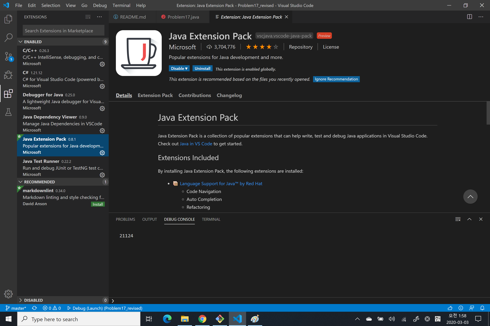

# Problem 17 Revised

## Problem 17 link

[https://github.com/jongfeel/ProjectEuler/tree/master/Problems/Problem17](https://github.com/jongfeel/ProjectEuler/tree/master/Problems/Problem17)

## System Requirement

- Tool: Visual Studio Code 1.42.1
  - Need to install Java Extension Pack
  - 
- SDK: java 13.0.2 2020-01-14
  - [https://www.oracle.com/java/technologies/javase-downloads.html](https://www.oracle.com/java/technologies/javase-downloads.html)
- Language: Java

## Test - bash

```bash
javac Problem17.java
```

```bash
java Problem17
```

## Test - Visaul Studio Code

- Open folder "Problem17" by Visual Studio Code
- Check out settings - launch.json
- Press F5 to debug start

## Why?

- 수학 문제를 프로그램을 짜는 방법으로 해결하라고 프로젝트 오일러 문제를 만들어 줬는데, 단순히 숫자 세고 더한거 밖에 없어서 프로그램으로 짠 의미가 없음.
- 그리고 앞으로 문제 의도에 맞지 않게 풀게 된 경우는 다시 풀어보는게 좋을 듯 해서 풀게 됨

## Next

- 다음부터는 이런 일이 일어나면
  - 처음 그렇게 생각해서 짠 방법과
  - 나중에 프로그램 적으로 해석한 방법
- 두 개를 한꺼번에 올리는게 나을 것 같다.

## Solve

- 내가 생각한 프로그램 적으로 짜는 방법은 이렇다.
- 1 to 1000 까지 loop을 돈다.
  - 숫자를 분석해서 영어로 쓰는 숫자 string을 만든다.
    - 이 때 space는 고려하지 않고 그대로 넣는다.
    - 예) 문제에서 342의 경우 "three hundred and forty-two"로 제시했는데 실제로 "threehundredandfortytwo" 이렇게 만든다.
    - ~~공백 지우는 코드 넣기 싫어서인 이유가 크다.~~
  - 그 string의 length를 구한다.
  - 준비한 sum 변수에 차곡차곡 더한다.
- sum 변수를 출력한다.

## Details

- 모든 숫자에는 규칙이 있으므로 그 규칙에 맞는 string을 구하기 위해 divide와 mod 연산을 한다.
- 예) 342을 구한다고 하면
  - 100으로 나눈 몫을 구해본다.
    - 3이므로 "threehundred"
    - 그리고 끝에 항상 "and"를 붙인다.
    - **예외** 100으로 나눈 나머지가 0이면 "and"가 붙지 않는다!
  - 나머지 값을 구한다 42이다.
  - 42를 가지고 10으로 나눈 몫을 구해본다.
    - 1이면 특수한 경우로 별도로 처리한다.
      - 특수한 경우란 eleven, twelve로 시작하는 10~19 사이의 숫자를 의미한다.
    - 여기서는 몫이 4이므로 "forty"로 만든다.
  - 나머지 값을 구한다 2가 남는다.
    - 2면 "two"로 만든다
  - 최종적으로 "threehundredandfortytwo"가 만들어지고 length는 23이 된다.
  - sum 변수에 더해준다.
- 이걸 판단하는 변수 값을 만들어 내면 다음과 같다. Problem17.java 파일에서 7 ~ 13 line에 해당한다.

``` Java
  int thousand = i / 1000;
  int thousandMod = i % 1000;
  int hundred = thousandMod / 100;
  int hundredMod = thousandMod % 100;
  int ten = hundredMod / 10;
  int tenMod = hundredMod % 10;
  int one = tenMod;
```

- divide, mod 값을 가지고 if, switch 문의 조합으로 각 숫자를 판별할 수 있고 그에 해당하는 string 값을 만들어 낼 수 있으므로 코드 보는 건 어렵지 않다.
- 정해진 숫자의 string 조합의 규칙을 만들어 낼 수 있는 근거를 이렇게 만들 수 있다는 게 중요하다.

## Debugging

- 164 라인의 주석을 풀면 1 ~ 1000 까지 **띄어쓰기 없는** 영어 숫자를 볼 수 있다.
- ~~누군가 정성을 다해~~ 띄어쓰기를 한 string으로 바꾸고 출력한다면 sum을 할 때 replace 함수를 써서 공백을 제거하고 sum을 해야 한다.
- 물론 이런 코드를 보고 number에 해당하는 하드코딩된 string 값에 일일이 띄어쓰기를 넣는 용자는 없을 것이다.