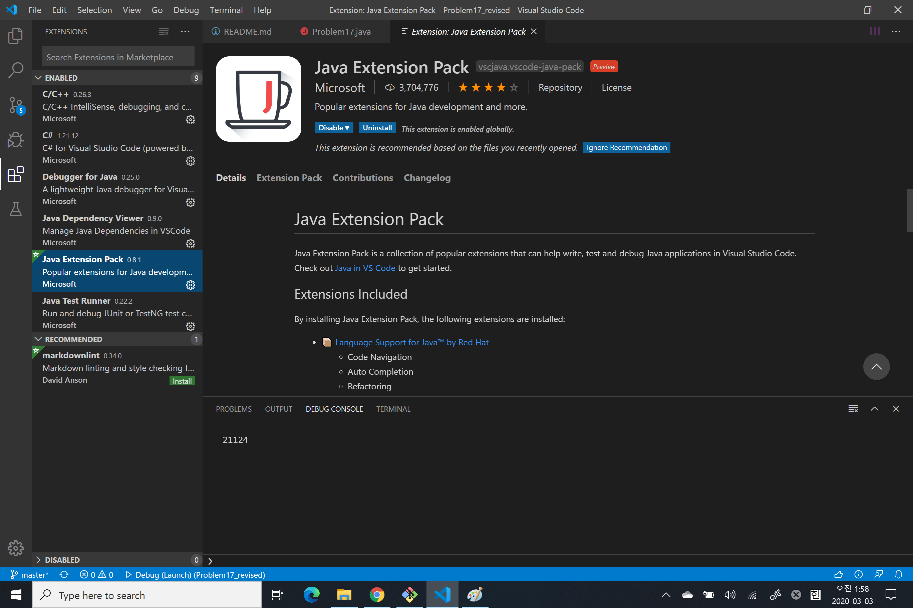

# Problem 22

## Names scores

Using [names.txt](https://projecteuler.net/project/resources/p022_names.txt) (right click and 'Save Link/Target As...'), a 46K text file containing over five-thousand first names, begin by sorting it into alphabetical order. Then working out the alphabetical value for each name, multiply this value by its alphabetical position in the list to obtain a name score.

For example, when the list is sorted into alphabetical order, COLIN, which is worth 3 + 15 + 12 + 9 + 14 = 53, is the 938th name in the list. So, COLIN would obtain a score of 938 × 53 = 49714.

What is the total of all the name scores in the file?

Korean: [http://euler.synap.co.kr/prob_detail.php?id=22](http://euler.synap.co.kr/prob_detail.php?id=22)\
English: [https://projecteuler.net/problem=22](https://projecteuler.net/problem=22)

## System Requirement

- Tool: Visual Studio Code 1.46.1
  - Need to install Java Extension Pack
  - 
- SDK: java 14.0.1 2020-04-14
  - [https://www.oracle.com/java/technologies/javase-downloads.html](https://www.oracle.com/java/technologies/javase-downloads.html)
- Language: Java

## Test - bash

```bash
javac Problem22.java
```

```bash
java Problem22
```

## Test - Visaul Studio Code

- Open folder "Problem22" by Visual Studio Code
- Check out settings - launch.json
- Press F5 to debug start

## Solve

문제에 방법이 다 주어져 있다.

- 우선 names.txt를 파일로 다운로드 받고 프로그램 최초 실행시에 파일을 읽어들인다.
- ,(comma)로 구분되어 있는 string을 split 함수를 사용해 string[] 형태로 얻어온다.
- 이름을 정렬하기 위해 Collections.sort() 함수를 사용한다. 이를 위해 string[]를 List< string >으로 변환한다.
- sorted list를 for문을 돌면서 name 하나씩 꺼낸다.
- name의 글자 하나씩을 꺼내기 위해 또 for문을 돌면서 글자 하나인 char 형으로 가져온 후
- ASCII 코드에 따라 A가 65의 값을 가지므로 글자 하나의 값을 숫자로 바꾸고 64를 빼준다
- 그러면 A 부터 1의 값을 가져서 Z까지 차례대로 26까지의 숫자를 얻을 수 있고 이걸 for문을 돌린 김에 더해주면 이름 하나에서 각 글자들의 값의 합을 구할 수 있다.
- List< string >을 돌던 for문은 첫 이름 부터 1의 index를 줘서 각 이름의 글자값을 더한 값에 곱한 후에 계속 더해 나간다.
- 마지막에 값을 출력해 본다.

## More think

- 이름의 정렬을 프로그램 언어의 라이브러리를 이용하는게 당연한데... 만약 좀 찜찜하다면 정렬 알고리즘 같은걸 사용해 봐도 좋을 것 같다.
  - 그런데 이번 문제는 이정도 까지를 요구하는 문제는 아닌 듯 하여 그냥 sort 함수를 잘 이용하는 걸로
- ASCII를 모른다면 A ~ Z 까지의 상수 값을 가지는 HashMap을 준비하고 활용해도 될 듯
  - HashMap<char, int> 의 형태가 될 것이다.
